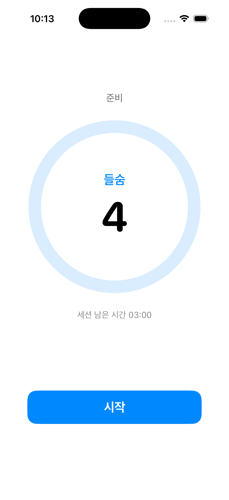
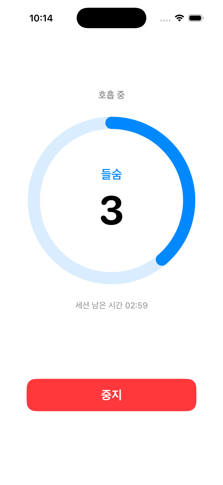
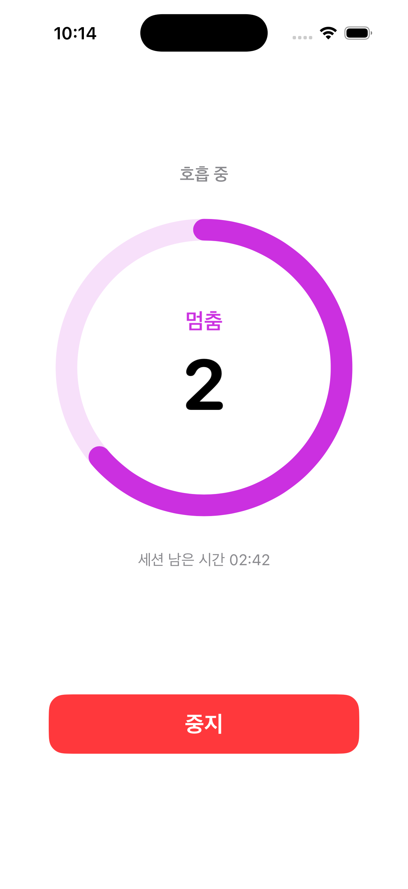
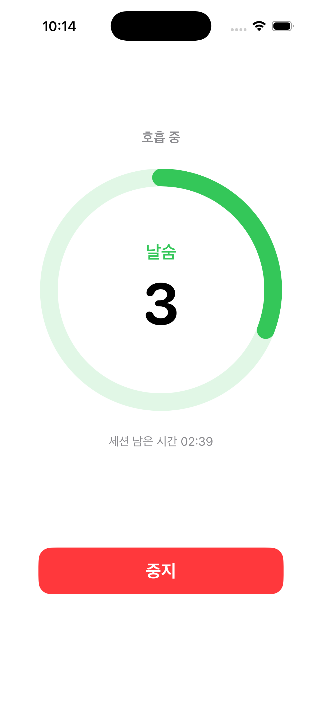
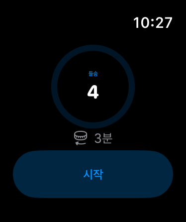
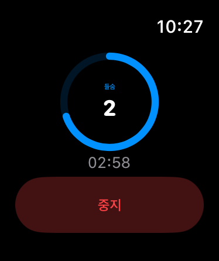
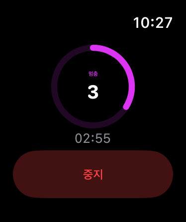
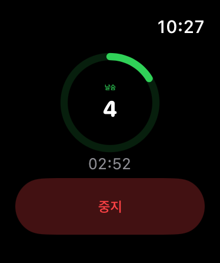
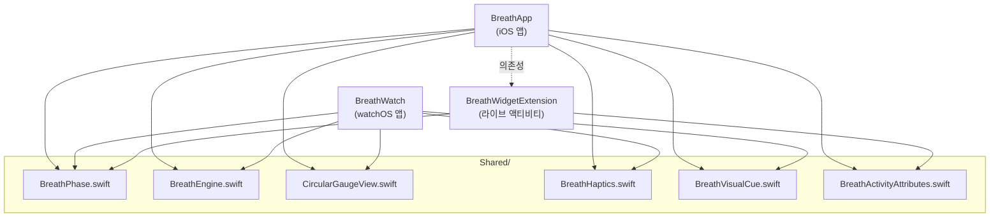

# 호흡 (Breath)
들숨 - 멈춤 - 날숨 4초 사이클을 안내하는 iOS · watchOS 호흡 앱입니다. 하나의 `BreathEngine`을 iPhone 앱, Apple Watch 앱, 라이브 액티비티 위젯이 함께 사용합니다.

`iOS 16.2+` · `watchOS 9.0+` · `Swift 5.0` · `SwiftUI` · `ActivityKit` · `WidgetKit` · `XcodeGen`

---

## 스크린샷
### iPhone
| 대기 | 들숨 | 멈춤 | 날숨 |
| :---: | :---: | :---: | :---: |
|  |  |  |  |
| 세션 길이와 시작 버튼 | 파랑 | 보라 | 초록 |

### Apple Watch
| 대기 | 들숨 | 멈춤 | 날숨 |
| :---: | :---: | :---: | :---: |
|  |  |  |  |
| Digital Crown으로 세션 길이 조절 | 파랑 | 보라 | 초록 |

iPhone과 Apple Watch가 **같은 `CircularGaugeView`** 를 씁니다. 워치 쪽은 화면 크기에 맞춰 선 굵기와 글자 크기가 비례 축소된 것일 뿐, 별도 컴포넌트가 아닙니다.

> 라이브 액티비티와 Dynamic Island는 시뮬레이터에서 촬영되지 않아 스크린샷이 없습니다. 실기기에서 확인할 수 있습니다.

---

## 주요 기능
### 호흡 사이클
- 들숨 → 멈춤 → 날숨을 각 4초씩 반복하며, 지정한 세션 길이(기본 3분)가 지나면 자동으로 종료됩니다.
- 단계마다 색상이 달라집니다 — 들숨은 파랑, 멈춤은 보라, 날숨은 초록. 이 색상은 [Shared/BreathPhase.swift](Shared/BreathPhase.swift)의 `tintColor` 한 곳에서 정의되어 앱 본체 · 위젯 · 워치가 모두 같은 값을 씁니다.
- 남은 초는 `contentTransition(.numericText())`로 굴러가듯 바뀝니다. (iOS 17 / watchOS 10 이상)

### 라이브 액티비티 · Dynamic Island
- 세션을 시작하면 잠금 화면에 현재 단계와 진행 게이지가 표시됩니다.
- Dynamic Island는 compact / minimal / expanded 세 가지 표현을 모두 지원합니다.
- 앱이 서스펜드된 뒤에도 게이지와 타이머가 계속 움직입니다. (아래 [설계 판단](#설계-판단) 참고)

### Apple Watch
- iPhone 없이 동작하는 독립 앱입니다.
- Digital Crown을 돌려 세션 길이를 1~10분 사이에서 조절합니다. 진행 중에는 값이 반영되지 않아 사이클 도중 길이가 튀지 않습니다.
- 41mm처럼 좁은 화면에서도 버튼이 밀려나지 않도록, 게이지 크기를 실제 가용 높이에서 역산합니다.

### 햅틱
화면을 보지 않고도 호흡을 따라갈 수 있도록, 세 단계가 서로 확실히 구분되는 감각을 갖게 했습니다.

| 단계 | watchOS | iOS |
| --- | --- | --- |
| 들숨 | `.directionUp` (올라가는 느낌) | `.light` |
| 멈춤 | `.click` (짧은 클릭) | `.rigid` |
| 날숨 | `.directionDown` (내려가는 느낌) | `.heavy` |
| 세션 완료 | `.success` | `UINotificationFeedbackGenerator(.success)` |

- watchOS는 방향성 햅틱이 있어 들숨 · 날숨에 그대로 대응됩니다. iOS는 방향성 햅틱이 없어 세기 차이로 대신합니다.
- 세션 완료 햅틱은 끝까지 마쳤을 때만 재생됩니다. 사용자가 중지 버튼을 누른 경우에는 울리지 않습니다.

### 접근성
- 햅틱을 느끼기 어려운 사용자를 위해 게이지가 들숨에 서서히 커지고 날숨에 서서히 작아집니다. 전환 순간에만 반짝이는 신호가 아니라 단계 내내 이어지는 변화라, 어느 순간에 화면을 보더라도 지금이 들이쉴 때인지 알 수 있습니다.
- **손쉬운 사용 → 동작 줄이기**가 켜져 있으면 크기 변화 대신 밝기 변화로 같은 정보를 전달합니다. 신호를 없애는 것이 아니라 형태만 바꿉니다.

---

## 아키텍처
세 개의 타깃이 `Shared/`의 파일을 **필요한 만큼만** 골라 포함합니다. 각 타깃의 소스 구성은 [project.yml](project.yml)에 선언되어 있습니다.



- `BreathWatch`는 `BreathActivityAttributes.swift`를 포함하지 않습니다. ActivityKit이 watchOS에 없기 때문입니다.
- `BreathWidgetExtension`은 엔진이 필요 없습니다. 표시용 모델만 있으면 시스템이 알아서 게이지를 채웁니다.

### 파일별 역할
| 파일 | 역할 |
| --- | --- |
| [Shared/BreathEngine.swift](Shared/BreathEngine.swift) | 들숨 → 멈춤 → 날숨 사이클을 돌리고 세션 길이가 지나면 자동 종료하는 호흡 엔진. UI 로직과 분리되어 독립적으로 테스트 가능 |
| [Shared/BreathPhase.swift](Shared/BreathPhase.swift) | 호흡 단계 열거형. 표시 문구 · SF Symbol · 강조 색상을 한곳에서 관리 |
| [Shared/CircularGaugeView.swift](Shared/CircularGaugeView.swift) | 현재 단계와 남은 초를 보여주는 원형 게이지. iPhone과 Apple Watch가 같은 컴포넌트를 공유 |
| [Shared/BreathHaptics.swift](Shared/BreathHaptics.swift) | 단계 전환과 세션 완료를 촉각으로 알림. 플랫폼별 햅틱 매핑 담당 |
| [Shared/BreathVisualCue.swift](Shared/BreathVisualCue.swift) | 햅틱을 대체하는 시각 신호 `ViewModifier`. 동작 줄이기 대응 포함 |
| [Shared/BreathActivityAttributes.swift](Shared/BreathActivityAttributes.swift) | 라이브 액티비티가 앱 ↔ 위젯 사이에 주고받는 데이터 계약 |
| [BreathApp/BreathActivityController.swift](BreathApp/BreathActivityController.swift) | 엔진의 단계 전환을 라이브 액티비티로 중계하는 얇은 래퍼. ActivityKit 생명주기를 여기에 가둠 |
| [BreathWidget/BreathLiveActivity.swift](BreathWidget/BreathLiveActivity.swift) | 잠금 화면과 Dynamic Island의 세 가지 표현을 한곳에서 선언 |

---

## 설계 판단
### 엔진이 ActivityKit과 SwiftUI를 모르게 했다
`BreathEngine`은 `onPhaseChange` / `onSessionEnd` 콜백으로만 바깥과 연결됩니다. 라이브 액티비티도, 햅틱도 엔진 입장에서는 그냥 "누군가 등록해 둔 클로저"입니다.
그 결과 watchOS 앱을 추가할 때 엔진을 **한 줄도 고치지 않고** 그대로 재사용할 수 있었습니다. iPhone은 콜백에 햅틱 + 라이브 액티비티를 연결하고, 워치는 햅틱만 연결합니다.

### 라이브 액티비티에 "남은 초"가 아니라 "시각 구간"을 싣는다
`ContentState`에 `remainingSeconds: Int`를 넣으면 매초 `Activity.update(_:)`를 호출해야 합니다. 그런데 화면이 잠기면 앱이 서스펜드되어 **그 update를 호출할 주체가 사라집니다.** 게이지가 그 자리에서 멈춥니다.

그래서 단계의 시작 · 종료 **시각**(`phaseStart` / `phaseEnd`)을 담습니다. 시각 구간을 넘겨두면 `Text(timerInterval:)`과 `ProgressView(timerInterval:)`가 앱 없이도 시스템 쪽에서 초를 세고 게이지를 채웁니다. 앱은 4초에 한 번, 단계가 바뀔 때만 갱신하면 됩니다.

```swift
struct ContentState: Codable, Hashable {
    var phase: BreathPhase
    var phaseStart: Date
    var phaseEnd: Date
}
```

역전된 구간은 `ClosedRange` 생성 시 크래시를 내므로 `phaseStart...max(phaseStart, phaseEnd)`로 방어합니다.

### `BreathPhase`에 `String` 원시값을 뒀다
라이브 액티비티의 `ContentState`는 앱 프로세스와 위젯 프로세스 사이에서 인코딩 · 디코딩됩니다. 원시값이 없으면 인코딩 결과가 케이스 **선언 순서**에 묶이므로, 나중에 단계를 추가하거나 순서를 바꾸면 이미 떠 있는 액티비티가 엉뚱한 단계를 표시할 수 있습니다.

### `endAll()`이 시스템 등록 액티비티 전체를 훑는다
로컬 참조(`activity` 프로퍼티)만 보면 놓치는 경우가 있습니다. 앱이 강제 종료됐다가 다시 실행되면 `BreathActivityController`가 새로 만들어져 `activity`가 `nil`이지만, 잠금 화면에는 이전 실행이 띄운 액티비티가 그대로 남아 있습니다.
그래서 `Activity<BreathActivityAttributes>.activities`를 전부 훑어 종료시키고, 이를 앱 실행 시점(`.task`)에도 한 번 호출합니다.

### 시각 신호는 `withAnimation`으로 값 두 개만 애니메이션한다
처음에는 `.animation(_:value: phase)`를 썼습니다. 그러자 아래에 붙은 뷰의 **색상과 글자까지** 같은 시간(4초)에 걸쳐 크로스페이드되어, 단계가 이미 바뀌었는데 화면에는 이전 문구가 흐릿하게 남았습니다.
지금은 크기 · 밝기만 `@State`로 따로 들고 `withAnimation`으로 그 값만 애니메이션합니다. 색상과 문구는 즉시 바뀝니다.

### 게이지 크기를 비율로 계산한다
`CircularGaugeView`는 선 굵기와 글자 크기를 `size`에 비례시킵니다. 280pt일 때 기존 iPhone 레이아웃 값(22 / 22 / 72pt)이 그대로 나오면서, 작은 워치 화면에서도 원본 비율이 유지됩니다. iPhone과 Apple Watch가 별도 컴포넌트를 갖지 않아도 되는 이유입니다.

---

## 요구 사항
- Xcode 14.1 이상
- iOS 16.2 이상 (라이브 액티비티 · Dynamic Island)
- watchOS 9.0 이상
- [XcodeGen](https://github.com/yonaskolb/XcodeGen) — `brew install xcodegen`

## 빌드 방법
```bash
git clone https://github.com/yuminc03/demo-breath.git
cd demo-breath
xcodegen generate
open BreathApp.xcodeproj
```

스킴을 선택해 실행합니다.

| 스킴 | 실행 대상 |
| --- | --- |
| `BreathApp` | iPhone. `BreathWidgetExtension`이 의존성으로 함께 빌드됩니다 |
| `BreathWatch` | Apple Watch |
| `BreathWidgetExtension` | `BreathApp`의 의존성이므로 단독 실행할 필요가 없습니다 |

라이브 액티비티와 햅틱은 시뮬레이터에서 온전히 재현되지 않습니다. **실기기에서 확인하는 것을 권장합니다.**

## ⚠️ XcodeGen 주의사항
`BreathApp.xcodeproj`는 [project.yml](project.yml)에서 생성되는 **산출물**입니다. Xcode UI에서 바꾼 빌드 설정은 다음 `xcodegen generate` 실행 시 사라집니다.

- **Signing & Capabilities의 Team 설정은 `project.yml`에 없습니다.** 프로젝트를 재생성한 뒤 실기기로 빌드하려면 `BreathApp`과 `BreathWidgetExtension` 두 타깃에 개발팀을 다시 지정해야 합니다.
- 빌드 설정을 영구적으로 바꾸려면 `.xcodeproj`가 아니라 `project.yml`을 수정하십시오.
- watchOS 앱은 현재 iOS 앱의 의존성으로 걸려 있지 않은 독립 구성입니다. 내장(companion) 구성으로 바꾸려면 `project.yml`에 주석 처리된 `- target: BreathWatch` 줄의 주석을 풀면 됩니다. 다만 그 경우 iOS 스킴 빌드에도 watchOS 시뮬레이터 런타임이 필요해집니다.

---

## 프로젝트 구조
```
Demo_Breath/
├── project.yml                          # XcodeGen 프로젝트 정의
├── BreathApp/                           # iOS 앱 타깃
│   ├── BreathAppApp.swift
│   ├── ContentView.swift
│   ├── BreathActivityController.swift   # 엔진 → 라이브 액티비티 중계
│   └── Assets.xcassets/                 # 앱 아이콘(iOS)
├── BreathWatch/                         # watchOS 앱 타깃
│   ├── BreathWatchApp.swift
│   ├── WatchContentView.swift
│   └── Assets.xcassets/                 # 앱 아이콘(watchOS)
├── BreathWidget/                        # 라이브 액티비티 위젯 익스텐션
│   ├── BreathWidgetBundle.swift
│   ├── BreathLiveActivity.swift
│   └── Info.plist
├── Shared/                              # 타깃 간 공유 코드
│   ├── BreathEngine.swift
│   ├── BreathPhase.swift
│   ├── CircularGaugeView.swift
│   ├── BreathHaptics.swift
│   ├── BreathVisualCue.swift
│   └── BreathActivityAttributes.swift
└── docs/screenshots/                    # README 스크린샷
```
